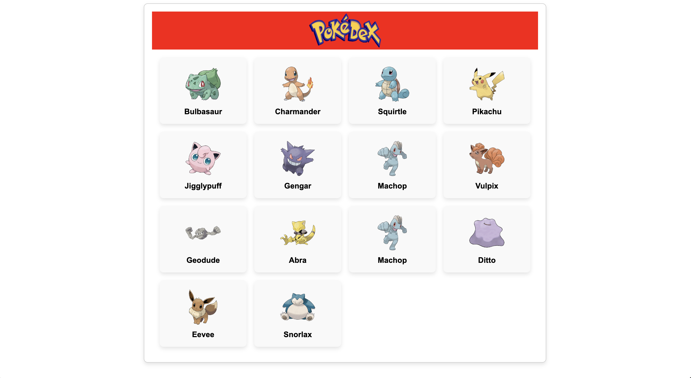
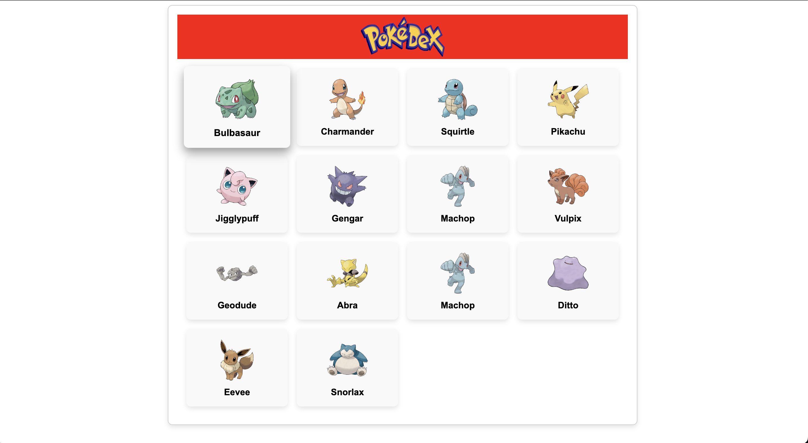
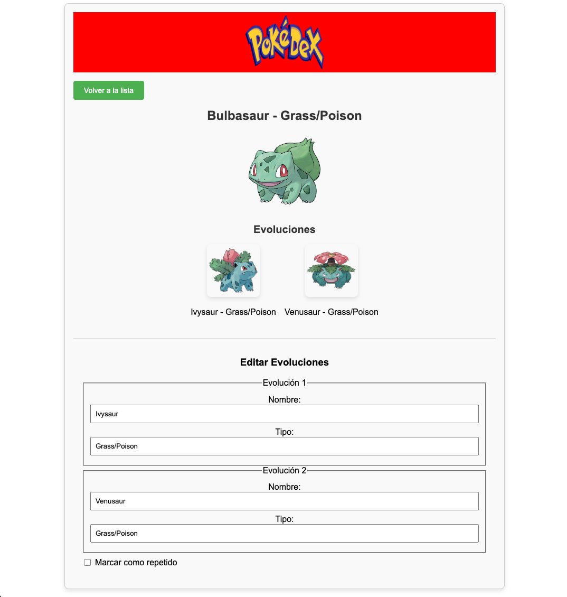
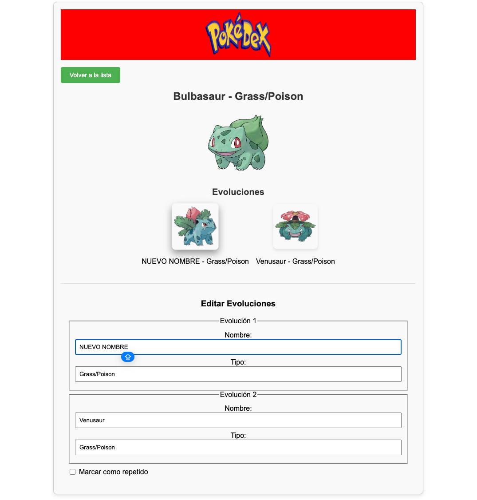
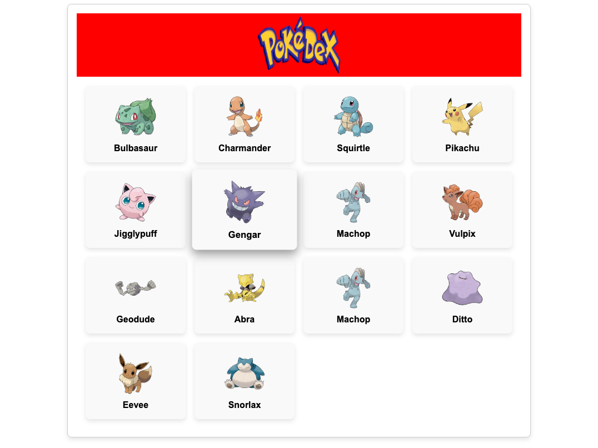
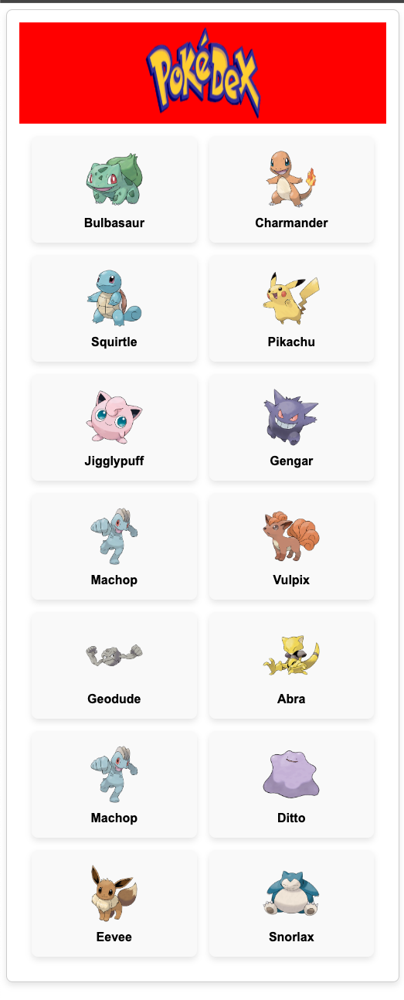

# Pokédex con LitElement

Este proyecto es una aplicación de Pokédex creada con [LitElement](https://lit.dev/) para practicar la creación de componentes web personalizados. La aplicación permite visualizar detalles de los Pokémon, sus evoluciones y editar en tiempo real sus datos. Además, incluye un modal para marcar Pokémon como duplicados.

## Características

- **Listado de Pokémon**: Muestra una lista de Pokémon con sus nombres y tipos.
- **Detalles de Pokémon**: Al seleccionar un Pokémon, muestra sus evoluciones y una opción para editar el nombre y tipo de cada evolución.
- **Edición en Tiempo Real**: Los cambios en los campos de nombre y tipo se reflejan instantáneamente en la vista principal.
- **Modal de Confirmación**: Opción de marcar un Pokémon como duplicado, mostrando un modal de confirmación.
- **Interfaz con Estilos Personalizados**: Estilos específicos aplicados para mejorar la UI, como efectos de hover y modal emergente.

## Tecnologías Utilizadas

- **LitElement**: Para la creación de componentes web reutilizables y reactivos.
- **JavaScript (ES6+)**: Lógica de la aplicación y gestión de estados.
- **HTML y CSS**: Para la estructura y estilos de la interfaz de usuario.
- **JSON**: Para simular los datos de Pokémon y sus evoluciones.

## Estructura de Archivos
pokedex-project/
├── src/
│   ├── components/
│   │   ├── ui/
│   │   │   ├── pokemon-list.js         # Componente para mostrar la lista de Pokémon
│   │   │   ├── pokemon-detail.js       # Componente de detalle de Pokémon con información y evoluciones
│   │   │   ├── pokemon-edit.js         # Componente para editar nombre y tipo de evoluciones
│   │   │   ├── modal-dialog.js         # Componente de modal para la confirmación de duplicado
│   ├── images/                         # Carpeta para imágenes de Pokémon
│   ├── app.js                          # Punto de entrada de la aplicación
├── index.html                          # Archivo HTML principal
├── package.json                        # Archivo de configuración de npm
└── README.md                           # Documentación del proyecto

## Instalación
git clone https://github.com/AdolfoCBasilio/pokemonapp.git
cd pokemon-app
npm install
npm start

## Uso
- **Ver Listado de Pokémon:** La página principal muestra una lista de Pokémon con sus imágenes, nombres y tipos.
- **Ver Detalles:** Haz clic en un Pokémon para ver más detalles sobre sus evoluciones.
- **Editar Evoluciones:** En la vista de detalles, puedes modificar el nombre y tipo de cada evolución. Los cambios se reflejan en tiempo real.
- **Marcar como Repetido:** Marca la casilla de "Marcar como repetido" para ver el modal de confirmación.

## Componentes Principales
pokemon-list.js: Muestra una lista de Pokémon con sus imágenes, nombres y tipos.
pokemon-detail.js: Muestra los detalles de un Pokémon seleccionado, incluida su imagen y evoluciones.
pokemon-edit.js: Componente de edición de evoluciones, permitiendo modificar nombre y tipo.
modal-dialog.js: Modal de confirmación que se muestra cuando un Pokémon es marcado como repetido.

### Contact
You can reach me at: [ [LinkedIn](https://www.linkedin.com/in/adolfocbg/) ]

